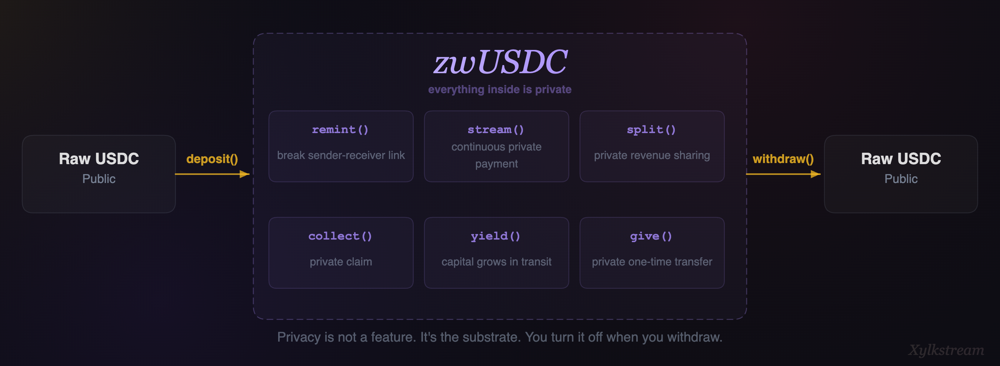
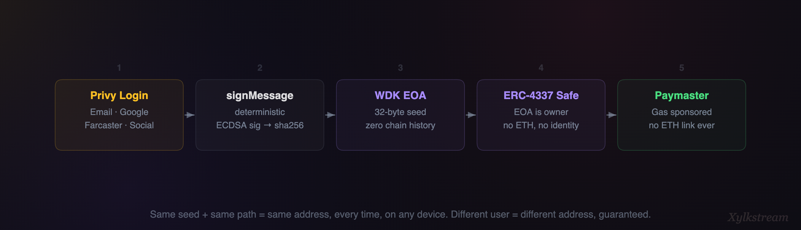
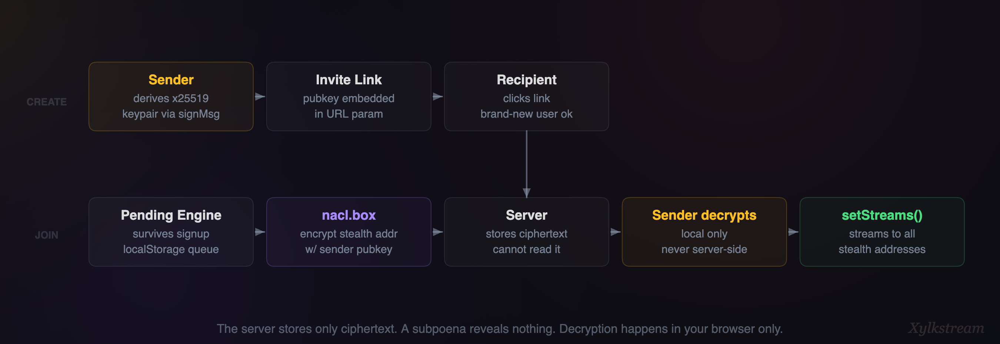
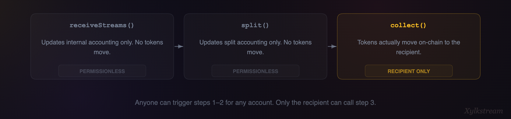
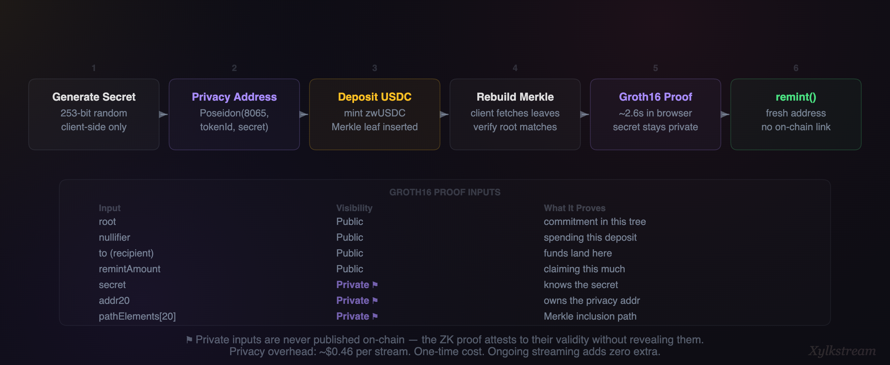
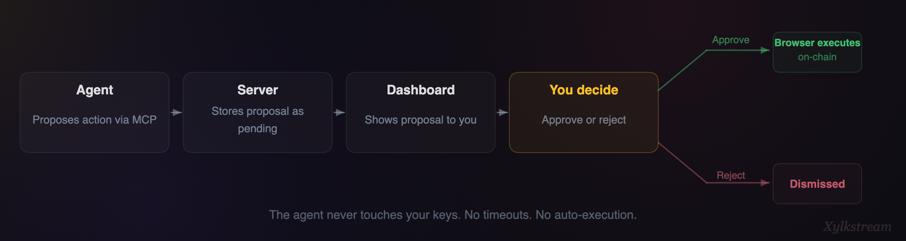
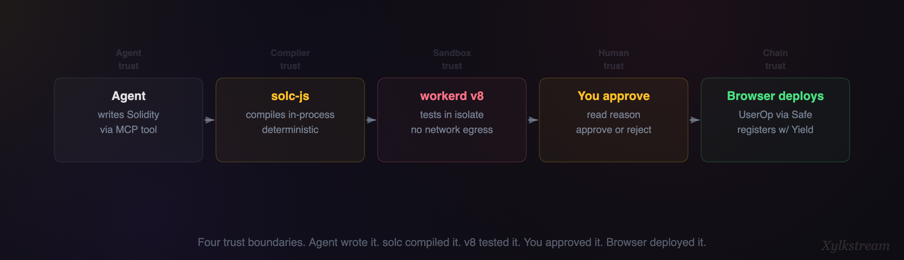
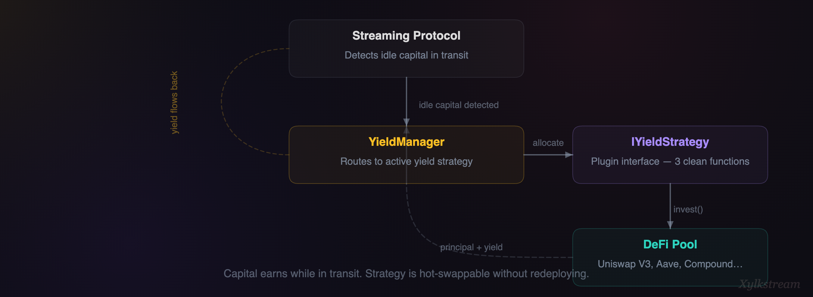
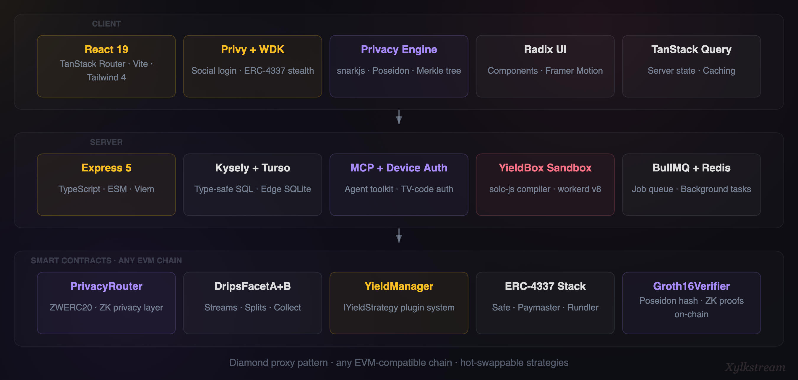

# Xylkstream

**Send money that grows while it travels. Nobody knows who sent it.**

---

## The Problem

$1T sent via Zelle in 2024. 300M+ P2P users in the US. Every dollar sits idle in transit earning nothing. Recurring payments, group treasuries, allowances. Dead capital.

Every payment is also a public record. Your employer, your landlord, your therapist, all linked on-chain. Privacy is an afterthought bolted on top, if it exists at all.

Xylkstream fixes both problems at once.

---

## The Core Idea

Money enters public. Goes private. Streams continuously to recipients. Earns yield while streaming. Exits public only when the recipient chooses.



Privacy is not a feature. Privacy is the substrate. You don't "turn on privacy." Everything is private. You turn it *off* when you withdraw to raw ERC20.

You're about to ask: "How do you stream money *and* earn yield *and* stay private, all at the same time?" That's what the rest of this explains.

---

## How Wallets Work: WDK Stealth Addresses

Before anything can stream or be private, you need a wallet that can't be traced back to you. Xylkstream uses Tether's Wallet Development Kit (WDK) to create **deterministic stealth wallets** backed by ERC-4337 smart accounts.

### 1. You log in with Privy.

Normal social login. Email, Google, Farcaster, whatever. Privy gives you an embedded wallet. This is your **public identity**. It holds your hot funds.

### 2. We derive a stealth seed from your Privy wallet.

```
Privy signMessage("xylkstream-stealth-seed-v1")
  → deterministic ECDSA signature (same every time)
  → sha256(signature)
  → 32-byte seed
  → WDK derives an EOA from this seed
```

Why `signMessage`? Because Privy won't give us the raw private key. But ECDSA signatures are deterministic: sign the same message, get the same signature, every time. Hash that and you have a perfect seed. Reproducible, but impossible to reverse without hacking Privy itself.

### 3. WDK creates an ERC-4337 Safe smart account.

The derived EOA becomes the **owner** of a Safe smart account. This Safe is your stealth wallet: zero on-chain history, no ETH, no connection to your Privy wallet.

You're about to ask: "If the Safe has no ETH, how does it pay for gas?"

It doesn't. A **Paymaster** sponsors every transaction. The stealth wallet never touches native ETH, because if your Privy wallet sent ETH for gas, that single transfer would link them on-chain. Game over.

### 4. Deterministic, unique, and CREATE2-safe.

Same seed + same path = same address. Every time. On any device. Recoverable from any Privy login. Different seed = different address, guaranteed.

Yes, deploying via CREATE2 exposes the owner's public key in the `initCode`. But that key was derived from an off-chain hash — it has **zero blockchain history.** An observer sees a blank, unrelated EOA they can't tie back to the Privy wallet.

For maximum privacy, use **2-3 recipients per stealth wallet.** This shatters the relationship graph while looking like normal on-chain activity. The sender absorbs the cost of multiple wallets, and that's exactly where the cost should be.



---

## How Circles Work: Group Streaming with Invite Links

Xylkstream doesn't stream to individual addresses. It streams to **circles**: invite-link groups where the sender can't even see the recipients' real addresses, and neither can the platform.

A circle is a group treasury. Family allowance, team payroll, friend pool. Anyone with the invite link joins, and the sender streams to all members at once. Every member's stealth address is **encrypted with the sender's public key.** The server stores ciphertext it can't read. A compromised database or a subpoena reveals nothing about who receives the money.

### Creating a Circle

**Step 1.** The sender derives an encryption keypair using the same Privy signMessage trick but with a different domain string — a third deterministic key from the same Privy wallet:

```
sig = privy.signMessage(keccak256("xylkstream-circle-encryption-v1"))
seed = keccak256(sig).slice(0, 32)
keypair = nacl.box.keyPair.fromSecretKey(seed)
```

**Step 2.** The sender creates the circle and gets an invite link:

```
https://app.xylkstream.xyz/circles/join?code=XYLK-7F3A&key=abc123def...
```

The `key` parameter is the sender's encryption public key, embedded directly in the URL. Anyone who clicks this link has everything they need to join and encrypt their stealth address for the sender.

### Joining a Circle

The invite link must work for **brand new users.** The **pending engine** handles this. It stores `{ type: "circle_join", inviteCode, senderPubKey }` in localStorage and survives signup, email verification, and wallet derivation across multiple page navigations. When the stealth wallet is finally ready, it fires:

```
1. Generate an ephemeral x25519 keypair (one-time use)
2. Encrypt stealth address: nacl.box(stealthAddressBytes, senderPubKey, ephemeralSecretKey)
3. POST to server: { inviteCode, encryptedStealthAddress, ephemeralPubKey }
```

The server never sees the stealth address. Only the sender, who holds the circle secret key, can decrypt the member list.

### Streaming to a Circle

The sender fetches the circle, decrypts each member's stealth address locally, and streams to all members with one `setStreams()` call. On-chain, an observer sees "some address streaming USDC to three other addresses." No identity links. No indication it's even a circle.



| The Server Knows | The Server Doesn't Know |
|---|---|
| A circle exists with this name | Who the members are |
| How many members joined | Members' stealth addresses |
| When they joined | How much is being streamed |

---

## How the Streaming Protocol Works

Circles use the same streaming primitive for every payment. A stream is a continuous flow of tokens metered per second. The sender deposits a lump sum. The protocol drains it at a fixed rate. Pure math. No cron jobs, no keeper bots.

Every call is a **UserOperation** through the ERC-4337 bundler. The sender's Safe never holds ETH.

### Collecting: The Three-Step Pipeline

Streams are collected in **cycles** (10s for testing, 1 day for production). Funds streamed during cycle N become receivable after cycle N+1 completes, batched for gas efficiency.



The first two steps are **permissionless**: anyone can call them for any account. They update internal accounting only. `collect()` requires the recipient's signature, because only they decide where the money goes.

This is deliberate. In a privacy-preserving system, the recipient might not be online. A friend, a bot, or an agent can trigger the accounting steps. Our E2E tests verify this: Charlie calls `receiveStreams()` and `split()` for Bob. Bob's funds become collectable. Charlie's balance stays at zero.

### Stream Management

**Partial withdrawal:** `setStreams()` with a negative `balanceDelta` and same receivers. Stream continues with reduced balance. **Stop:** empty receivers, drain everything. Protocol returns whatever remains.

---

## How Privacy Works: ERC-8065 and the Privacy Sandwich

Every privacy system on Ethereum today is either a mixer (Tornado Cash: good privacy, one trick) or a full L2 (Aztec: great privacy, entirely separate chain). There's nothing in between.

**ERC-8065** is that standard. It defines a single interface (`ZWERC20`) that wraps *any* ERC20 with a ZK privacy layer. Deposit USDC, get zwUSDC. Prove ownership with a Groth16 proof. Remint to a different address with no on-chain link.

| | Tornado Cash | ERC-8065 |
|---|---|---|
| Denominations | 0.1, 1, 10, 100 ETH only | Any amount. Partial remints. |
| Token support | ETH + a few tokens, separate pools | Wraps *any* ERC20 |
| NFT support | None | Built-in via `id` parameter (id=0 fungible, id>0 NFT) |
| Composability | Standalone mixer | Wrapped token is a standard ERC20, works with any protocol |
| Post-privacy | Withdraw or nothing | Reminted tokens stay private, keep using them |

Tornado Cash is a privacy *detour*: you go in, you come out. ERC-8065 is a privacy *layer*: you go in, and everything from that point on is private. Xylkstream is the first protocol to use ERC-8065 as **Layer 0**, the foundation, not an addon.



### The Shielding Flow

**Step 1.** Generate a secret. A random 253-bit number, client-side only, never on-chain. This is the only thing that proves ownership.

**Step 2.** Derive a privacy address:

```
privacyAddress = Poseidon(8065, tokenId, secret) mod 2^160
```

A valid Ethereum address, but nobody controls its private key. You're about to ask: "Then how do you spend from it?" You don't. You **prove you know the secret** via a ZK proof, and the contract mints fresh tokens to a completely different address. That's the remint.

**Step 3.** Deposit USDC into ZWERC20. The contract pulls USDC, mints zwUSDC to the privacy address, computes a Poseidon commitment, and inserts it as a leaf in a depth-20 Merkle tree.

**Step 4.** Rebuild the Merkle tree locally. The client fetches all commitment leaves from the chain, reconstructs the tree, and verifies the local root matches the on-chain root exactly. Then computes a nullifier: `Poseidon(addr20, secret)`, unique to this deposit, prevents double-spending.

### The Remint (ZK Proof Breaks the Link)

**Step 5.** Generate a Groth16 ZK proof (~2.6s in browser):

| Input | Public/Private | What It Proves |
|---|---|---|
| root | Public | "My commitment is in *this* Merkle tree" |
| nullifier | Public | "I'm spending *this* specific deposit" |
| to (Bob) | Public | "Send the funds *here*" |
| remintAmount | Public | "I'm claiming *this* much" |
| secret | **Private** | "I know the secret that created the commitment" |
| addr20 | **Private** | "I know which privacy address holds the funds" |
| pathElements[20] | **Private** | "Here's the Merkle path proving inclusion" |

**Step 6.** Call `remint()`. The contract verifies the proof, checks the nullifier hasn't been used, marks it spent, and mints zwUSDC to Bob's address. On-chain: "Alice deposited USDC. Bob received zwUSDC." No cryptographic link between the two.

### Where Can't You Cheat?

| Attack | Why It Fails |
|---|---|
| Forge a proof | ZK. Computationally infeasible. |
| Reuse a nullifier | Contract rejects. Permanently marked spent. |
| Claim more than deposited | Circuit enforces `remintAmount <= commitAmount`. |
| Link deposit to remint | Secret and privacy address are private inputs, never on-chain. |
| Correlate by amount | Partial remints supported: claim any amount up to deposit. |

### The Full Private Stream

```
Sender: PrivacyRouter.setStreamsPrivate(USDC, receivers, ...)
  Pull USDC → mint zwUSDC → remint to fresh address (ZK proof) → setStreams
  On-chain: "Some address deposited USDC. A different address started streaming zwUSDC." No link.

Recipient: PrivacyRouter.collectPrivate(...)
  Collect zwUSDC → remint to fresh address → optionally withdraw to raw USDC
  On-chain: "Some address collected. A different address withdrew USDC." No link.
```

Privacy overhead: **~$0.46 per stream** on most EVM chains. One-time cost. Ongoing streaming adds zero extra cost.

---

## How Agents Work: AI Proposes, Humans Approve, Browser Executes

Agents are external AI systems that connect to Xylkstream, read your state, and propose actions. You approve or reject in your dashboard. If approved, your browser signs and executes. The agent never touches your keys.

### Agent Authentication: Device Auth

Same pattern your TV uses when it asks you to visit a URL and enter a code:

```
1. Agent calls POST /device-auth/start → { deviceCode, userCode: "XYLK-7F3A" }
2. You enter the code in your browser → POST /device-auth/authorize
3. Agent polls → gets a 15-minute JWT
4. Agent uses JWT as Bearer token for the MCP endpoint
```

### MCP: The Agent's Toolkit

The agent connects via **Model Context Protocol (MCP)**, each session scoped to the authenticated user.

**Read tools:** `get_balances`, `list_streams`, `list_circles`, `get_proposals`

**Write tools:** `propose_adjust_stream`, `propose_collect`, `propose_deploy_strategy`, `submit_strategy`, `log_thought`

Every write tool (except `log_thought`) creates a pending proposal with the agent's reasoning. The proposal sits in the database until you act. No timeouts, no auto-execution.



---

## How YieldBox Works: Agents Write Strategies, Sandboxes Compile Them

The agent doesn't just *select* yield strategies. It **writes** them in Solidity and submits them via MCP. But running arbitrary AI-written Solidity against production contracts would be insane. So we sandbox everything.

**Step 1.** Agent submits Solidity source. `submit_strategy({ name, sourceCode })` is stored as `pending` and async compilation is triggered.

**Step 2.** Server compiles in-process with `solc-js`. No sandbox needed — solc is a deterministic compiler that doesn't execute code. Compilation result (bytecode + ABI) is stored to the database.

**Step 3.** Agent reads results and proposes deployment:

```
get_strategy_results({ strategyId }) → { status: "compiled", bytecode, abi }
propose_deploy_strategy({ strategyId, reason: "Compiles clean, implements IYieldStrategy" })
```

Optionally, before proposing deployment, the agent can submit a test script. This runs inside a **workerd v8 isolate** — a standard ES module worker with `env.evm` injected as a binding. The isolate deploys the contract to an in-memory EVM, calls all view/pure functions with default arguments, and returns pass/fail results. Network egress requires an explicit capability declaration — none is granted, so the sandbox can't make outbound calls. If no test script is provided, one is generated automatically from the ABI.

**Step 4.** You approve. Your browser fetches the bytecode, deploys via stealth wallet UserOp, and registers with YieldManager.

The agent wrote the code. `solc-js` compiled it in-process. The v8 isolate tested it. You approved it. Your browser deployed it. Four steps, four trust boundaries.



---

## How Yield Works: The Strategy Plugin System

YieldBox creates strategies. The **YieldManager** executes them.

Any yield strategy implements three functions:

| Function | What It Does |
|---|---|
| `invest()` | Open a position (e.g., concentrated liquidity). Return position data. |
| `withdraw()` | Close position, collect fees, convert back to original token. |
| `forceWithdraw()` | Emergency withdrawal when a stream closes early. |

Three functions. Any DeFi protocol can be wrapped as a strategy and hot-swapped without redeploying contracts.



Fees are collected automatically during withdrawal. The agent monitors performance and can propose switching strategies at any time.

---

## Architecture



### Diamond-Style Facet Split

Core Drips contract was 17.6KB, too large for a single deploy. Split into two facets:

| Contract | Role | Size |
|---|---|---|
| DripsRouter | Selector-based routing proxy | 789B |
| DripsFacetA | Streams, drivers, balances, withdraw | ~13.9KB |
| DripsFacetB | Splits, give, collect, setSplits | ~10.4KB |

`ManagedProxy → DripsRouter → FacetA/B` via delegatecall. Both facets share storage through identical `_erc1967Slot` names.

### The Privacy Stack

| Component | What It Does | Status |
|---|---|---|
| ZWERC20 | Wraps any ERC20 with ZK privacy | Built |
| Groth16Verifier | On-chain ZK proof verification | Built |
| PoseidonT3 | Poseidon hash library for commitments | Built |
| remint.circom | ZK circuit: proves ownership without revealing source | Built |
| Privacy Engine | Client-side: secrets, Merkle, proofs, nullifiers | Built |
| PrivacyRouter | Unified entry point that wraps/unwraps ZWT transparently | Built |

---

## The Trust Model

| Layer | What It Does | Who Runs It |
|---|---|---|
| WDK + Privy | Deterministic stealth wallet derivation | Client-side |
| Paymaster | Gas sponsorship (no ETH link to identity) | Protocol |
| ZWERC20 | ZK privacy: deposit, remint, withdraw | Smart contract |
| Groth16 Verifier | Proof verification | Smart contract |
| Drips (FacetA/B) | Streaming, splits, collection | Smart contract |
| YieldManager | Capital allocation to strategies | Smart contract + AI agent |
| MCP Agent | Strategy selection and monitoring | Self-hosted / any runtime |
| Bundler (Rundler) | UserOperation submission | Self-hosted |

No single point of trust. The Paymaster can't see your secret. The bundler can't forge your proof. The agent can't move your funds without approval. The contracts enforce the math.

---

## Team

**Kelvin** — Contracts, ZK circuits, protocol architecture. Previously built Sentiment Drips (DAO treasury streaming), Vidrune (video indexing engine), and Crystalrohr (video search engine).

**Liz** — Frontend, UI/UX, brand. Previously built Soundsphere (decentralized music sharing app). Content and brand strategist.

---

## Stack

| Layer | Technologies |
|---|---|
| Contracts | Foundry, Solidity 0.8.20, Shanghai EVM, OpenZeppelin, Circom + snarkjs |
| Server | Express 5, TypeScript, ESM, Viem, Privy server auth, Kysely + Turso, BullMQ + Redis, MCP SDK |
| Client | React 19, TanStack Router + Query, Privy React auth, WDK ERC-4337, Tailwind 4, Framer Motion, Radix UI, Vite |
| Agents | MCP server, device auth (TV-code flow), WebSocket proxy, proposal queue |
| Privacy | ERC-8065 ZWERC20, Groth16 (snarkjs), Poseidon hash, depth-20 Merkle tree, Rundler bundler |

---

## Running

```bash
# contracts
cd apps/contracts && forge build && forge test

# server
cd apps/server && npm install && npm run dev

# client
cd apps/client && npm install && npm run dev

# e2e tests (requires Anvil + deployed contracts + Alto bundler)
cd apps/client && npm run test:e2e
```

Server runs on port `4848`. Requires `.env` with Privy keys, RPC URL, Redis URL, and Turso credentials.

---

## Sources

- Zelle Network (2025): $1T processed in 2024, +27% YoY, 151M accounts
- PayPal/Venmo (2025): 107.6M active users
- a16z Crypto (2025): $46T stablecoin volume, 3x Visa
- Banerjee et al. (2023): GiveDirectly Kenya, streaming vs. lump sum
- Davis (2025): Earned wage access, +11.5% income
- Suri & Jack (2016): M-PESA lifted 194K households from poverty, Science
- Prelec & Loewenstein (1998): Streaming reduces pain of paying
- World Bank Findex (2021): Digital payments 35% to 57% in developing economies
